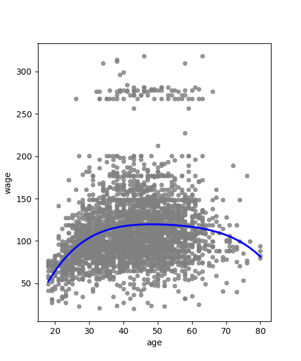

# git-intro

A demo repository with guidelines for assignment submission.

## Document for reproducibility

* Jupyter notebooks are not acceptable.
* Results must be reproducible.
* Document your data source and provide appropriate attribution.
* Provide clear instructions for every step in the data-processing pipeline, including data access.
* If you need to download data, then put it in a `data` directory and make sure to ".gitignore" it.
* If you keep a local copy of a dataset, be sure to provide appropriate attribution and links to the data source.
* Provide instructions for reproducing all results from the command line.
* Apply DRY principles, e.g., if multiple files use the same code, then put reused code in a module and import it.
* Document for the 6-month rule
* While there may be more than one way to do everything, here's the way to go...
  * Put source code in the `src` directory, figures in a `figs`directory, and tests in a `tests` directory.
  * Use one file for each question/step, not one file for all questions/steps.
  * Use a Makefile to implement and document the entire data-processing pipeline.
  * One annoying thing about `make` is that you must indent in the Makefile with tabs -- spaces don't work, alas.

For example, suppose the assignment has a data-access step and one question...

## Step 1: Data access

Download the CSV file from the [ISL](http://statlearning.com) website with the following command

```
make data
```

* This step is automatic if you start with Q1 (below)
* This step is necessary when you first clone the repo because CSV files are .gitignored.
* If you don't have requisite software, check out [install.md](http://github.com/ds5010/spring-2023/install.md).
* If you're not familiar with git, check out [git.md](http://github.com/ds5010/spring-2023/git.md).

## Q1: Presentation of results

This section recreates and presents the first chart in Figure 1.1 of ISLR2.
Recreate the chart below with
```
make q1
```



The locally generated PNG is embedded in the markdown using HTML, which allows you to set the desired with.
This next image demonstrates another way to [embed a PNG in markdown](https://docs.github.com/en/get-started/writing-on-github/getting-started-with-writing-and-formatting-on-github/basic-writing-and-formatting-syntax#images).


## Share your environment (optional)

If you're using special software, or you need a specific version, then use 
[conda](https://conda.io/projects/conda/en/latest/user-guide/tasks/manage-environments.html) 
and provide instructions with an `environment.yml` file.
I created an environment.yml for this repo by first running this command
```
conda env export > environment.yml
```
Then I used the `--from-history` option to get hints on editing/trimming the file into something nice and short.
```
conda env export --from-history
```
I settled on this for my environment.yml...
```
channels:
  - conda-forge
  - defaults
dependencies:
  - seaborn=0.11.2
  - pyqt
```
Ref: [Sharing an environment](https://conda.io/projects/conda/en/latest/user-guide/tasks/manage-environments.html#sharing-an-environment)

## Create an environment

You can create an environment from a .yml file as follows:
```
conda env create --name myenv -f environment.yml
```
Remove an environment with:
```
conda env remove --name myenv
```
* Ref: [Creating an environment from an enviroment.yml file](https://conda.io/projects/conda/en/latest/user-guide/tasks/manage-environments.html#creating-an-environment-from-an-environment-yml-file) -- conda.io
